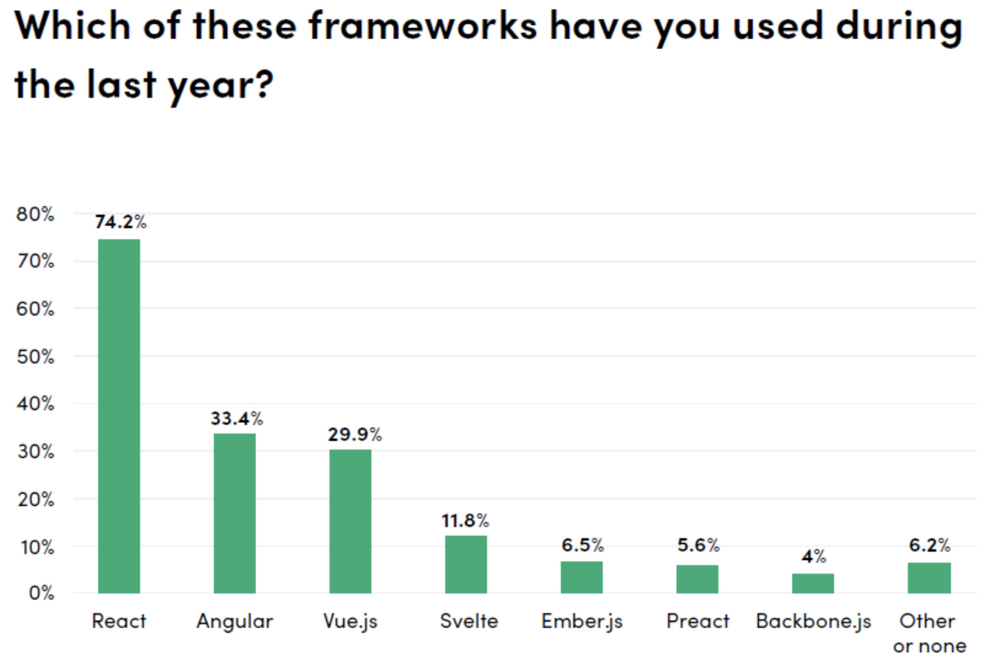
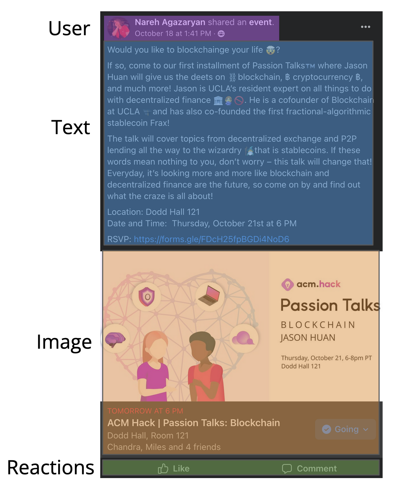
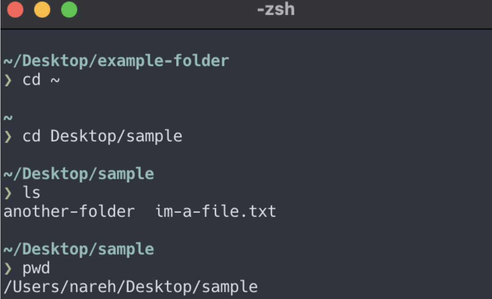
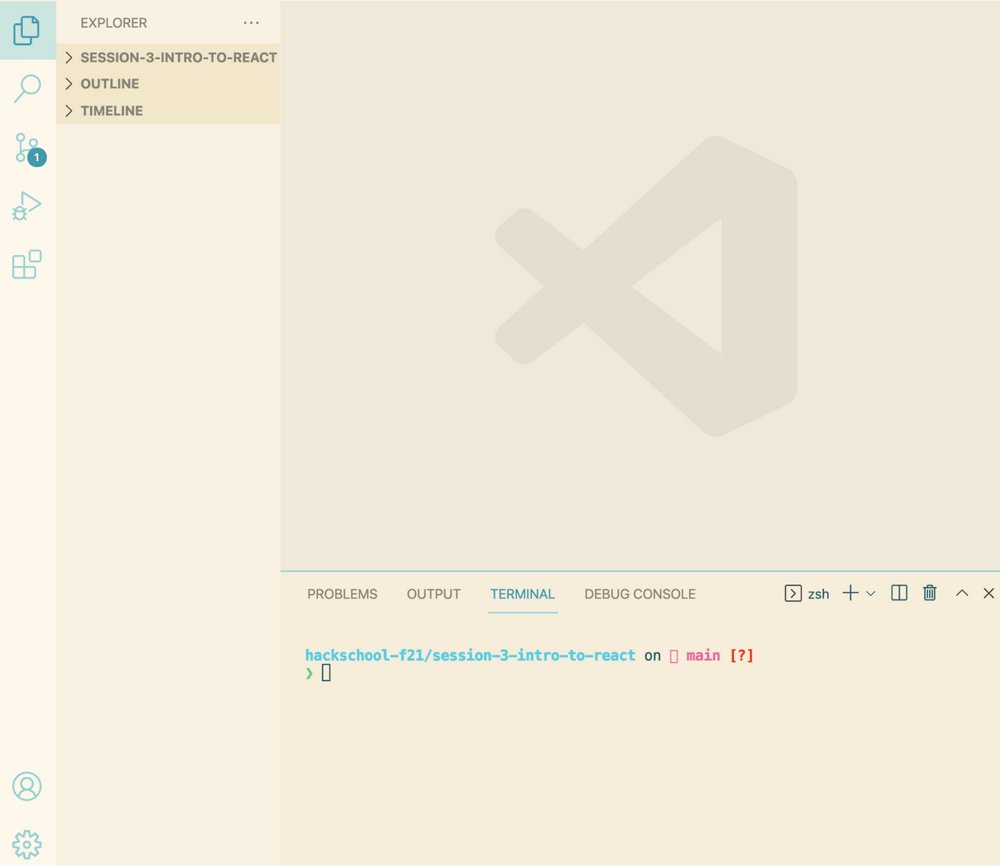

# Hackschool Session 3: Introduction to React

**Date**: October 20, 2021

**Location**: Perloff Hall 1102

**Teachers**: [Nareh Agazaryan](https://github.com/nareha), [Eric Yang](https://github.com/eric8yang)

## Resources

- [Slides](https://docs.google.com/presentation/d/1HBMlVmoG8n3r0LJ3KwD9QJYiteT4U2pdHxQ32yRy1Qc/edit?usp=sharing)
- [ACM Membership Attendance Portal](https://members.uclaacm.com/login)

## What we'll be learning today
- [What is React?](#what-is-react?)
    - [Why React?](#why-react?)
- [Setting up a React Project](#setting-up-a-react-project)
- [How to Work in React](#how-to-work-in-react)
    - [Introducing Import](#introducing-import)
    - [JSX](#jsx)
- [Components](#components)

---
## What is React?
So far in this series, we've covered HTML, CSS, and JavaScript. While these tools are sufficient for certain websites and web apps (the difference between the two is that apps are interactive, while websites don't have user interactivity), some projects benefit from using a "library" (a set of "tools" that will add some benefits to your coding experience for certain tasks). One of these libraries is **React**. 

ReactJS is a JavaScript library for building user interfaces. User interfaces, usually shortened to UI, are things that a user can interact with on the webpage. This is why often times we'll refer to React projects as React apps. The React website can be found [here](https://reactjs.org). It contains documentation for beginner and advanced topics, some of which we'll touch upon in this series, as well as some tutorials and other useful information.

React is created by Facebook, and Facebook actually uses React in their websites and applications! This means that Facebook is directly invested in improved React, which is great for us non-Facebook developers as well using React!

React could be considered decently new, as opposed to some other libraries such as AngularJS and jQuery. Even though it is newer than some other libraries, it's extremely popular, and only growing in popularity! Some other companies that user React are Airbnb, Uber, Netflix, Skype, and more! The general number of websites that use React are around 10 million. This article [here](https://codeburst.io/top-javascript-frameworks-and-web-development-trends-in-2021-313194c0cd92) also demonstrates that JavaScript developers overwhelmingly have been using React recently, compared to its competitors.



All this is to show that React is an extremely popular library, and something viable for usage whether you're just starting your web development journey, or are learning for the first time!

### Why React?
Popularity is definitely a selling factor, but why do we use React specifically? This is something we'll come to realize throughout the series. The basic concepts of React that make it so great to use is **reusability** and **efficiency**. Let's consider Facebook, for example. Facebook is comprised of a bunch of posts, each of which have a *user*, *text*, *an image*, and *reactions*. 



This is true for all posts, if we were to simplify them down, ignoring events and selling and whatnot. We could copy paste the code for a post multiple times, but in HTML, this would include a LOT of repeated and lengthy code. We won't dive into what React can do to fix this specifically at this moment, but React in short can simplify this greatly, and reduce the need for repeating such large pieces of code (see this workshop's section on [Components](#components) for more information)!

## Setting up a React Project
Before we get started, one thing that's important to introduce is the terminal! It's possible you may already have experience using the terminal, but in the case that you don't, ~terminal~ essentially refers to a text-based interface that we can send commands to. Those commands will execute different things in our computer. We're going to be using the terminal with a couple commands to interact with our application, so we'll need to see it a bit. Luckily, Visual Studio Code includes a place to open the terminal, so we won't have to worry too much about it! A terminal may look something similar to the image below. I have some customizations to mine, so it won't look exactly the same, but the general concept is the same! There is a section to type commands, and those commands will directly interact with the computer.



You can open the terminal on your computer by either opening spotlight (Cmd+Space) and searching for “Terminal” on MacOS, or opening the start menu (Windows key) and searching for “cmd” on Windows. If you are on Linux, it may depend on your distro, but I presume if you are on Linux then you know how to open the terminal! For a deeper dive into the terminal, I highly recommend checking out ACM Hack's previous iteration of the Tooling Series [here](https://tinyurl.com/tooling-3).

## How to Work in React
There are 3 main steps to starting a React application. First, create a folder anywhere on your computer. Typically, we don't put spaces in folder names, so use hyphens if you have to separate words. In our Github repository (where you are currently viewing this), the folders are a good example of how to do so! It's good practice to do so. 

Open Visual Studio Code, and open the folder. This can be done in two ways. VSC has a welcome menu that has an option to open a folder. It can be done this way. Otherwise, both MacOS and Windows will have a menu bar at the top. You can click File -> Open Folder and navigate to the folder using your file explorer (Finder on Mac). 

Once you've done so, you can open the terminal! In the same menu bar where File is, there is a tab called "Terminal"! Click Terminal --> New Terminal. This will open a tab that looks similar to the following:



Again, mine is customized, so even in VSC it looks a little different, but functionally is the same!

Now, we must download something called [Node](https://nodejs.org/en/) (download link here, download LTS not current!). Node, without delving too deep conceptually, is another tool that is necessary for us to run our React application. You can check if you have node installed already by typing `node -v` into the terminal (after typing this, press Enter to let the terminal know that you're done typing a command!). If a number shows up, then you've already installed Node! If there is no number or there is an error, click the link above to download Node! The reason for needing Node is a little complex, but for our purposes the main reason is because of something called **npm**, short for Node Package Manager! "Package managers”, in essence, let us install, update, and remove programs. npm is a package manager for Node programs and tools, that we can install, update, and remove. It also contains commands that will be how we actually run our React app!

On that topic, we can actually create our React application! Unfortunately, it isn't as simple as just opening a file as it was with HTML, but lucky for us, npm provides us with the simplicity to do almost that! First, React requires a lot of files for its functionality, but we don't have to make it ourself. npm has the following command, `npx create-react-app my-app`, that will create the React project will *all* its necessary tools! When running that command, it'll take a big to completely finish, but once you see "Happy Hacking", and the ability to type again, then you'll know it's done! What this does is create all the necessary React files in a folder called `my-app`. Realistically, you can name the folder whatever you'd like, but the default one for tutorials is my-app.

Just some extraneous knowledge, but you may actually create all the files in the folder you are idrectly running it from without creating another folder inside it. This is done by doing `npx create-react-app .`. `.` represents the current folder we are in, in terms of the file system organization. If this sounds like nonsense, don't worry too much! There's no real difference between the two methods, it may actually be more desired to have it in its own folder for most purposes.

Once your React application is ready to go, we will execute the next two commands in the terminal:
`cd my-app`
`npm start`

`cd` stands for "change directory", essentially taking you to whatever folder you specify. There is a little more to the command, but we'll refrain from going too far into it, since for our purposes this is all we'll need to do.
`npm start` is just an npm command that asks to start running the project. This will create something called "localhost", and clicking on that link that appears in the terminal will take you to your React app! This is just a local "server" for your React application while you develop. Once you kill the terminal, the server will close.

Within the default React files, there's a lot of files that can be a little complex and confusing, but for now, we will only focus on the `src` folder. This folder contains files that directly contribute to the content on the page. The content is held in all JavaScript files, since React is a JS library. We'll talk more about what you can do in src in future workshops as well as later in this workshop, but for now, just consider `App.js` and `App.css` as our main files. Any content you put in here will directly appear on the page. Think of `App.css` as the `style.css`, and `App.js` sort of like the index.html from our HTML workshop.

> There actually is an index.html file in public, but we don't put content in there, however that still is the entry point for the website.

Anything we put into the `App.js` will appear if its within the parantheses in the return statement JavaScript expressions on the page. Again, we won't get too deep into each individual piece, but feel free to observe what is in `App.js`! 

### Introducing Import
At the top, you may notice some sentences that start with `import`. We'll get into export more at a later point in this workshop. `import` simply allows us to use contents from another file in our current file. When `App.css` is imported, that means that all the style rules from that file will apply to `App.js`! We can also import some other files, including other JS files and images, but we'll see that at a later point!

### JSX
You may notice something a little strange in `App.js`-- it looks like HTML mixed in the JavaScript code! This actually isn't pure HTML, this is something called JSX! JSX is sort of a hybrid of JS and HTML.

JSX extends what JavaScript usually allows in order to allow for HTML-like elements. They're not actually HTML elements. They create React “elements”. These will describes the look of the UI to React, in order to know how to display the content on the page!

For example, we can do the following, and this is totally valid!

```js
let element = <h1>Hello, world!</h1>;
```

Another feature we'll use extensively is putting variables and other JavaScript expressions inside React elements using {braces} (sometimes people call these curly brackets). For example:

```js
const name = 'Eric';
const facts = <p>{name} is swag :)</p>
```

is another totally valid statement! This allows for a ton of flexibility for how to write our code.


## Components
### What is a component?
Components represent a way to reuse elements on your web application. Imagine a Twitter feed where each post has the format but is filled slightly differently. In this case, it would be insane to have to go through and change each and every HTML element if we wanted to edit the format of a post. For example, if we wanted to make all of the usernames unbolded instead of bolded, we may have to go through each and every post element and delete a tag. The solution to this madness is components. 

### How do we create components?
To begin working with components, we usually create a new folder called `components` for them in the `src` folder. After this is done, we can create a `.js` file to store our component (`Post.js` for example). Setting up the component will look something like the following:
```js
import React from 'react';

function Post(){
    return <h1>hello</h1>;
}

export default Post;
```

What's shown here from the top:
1. React is imported so we can use parts of it in our file.
2. A function is defined where
    1. The name matches the name of the file
    2. A single JSX element is returned from the function
3. The component is exported so we can later import it into another file

### How do we use the component?
After our component is well defined and exported, we can use the component by importing it into another file.

#### How do we import files?
Importing is done in React using the import keyword (what a shocker) followed by a path to the file as a string. For example, if we wanted to import the `Post` component into the `App.js` file, we could simply write the line:
```js
import Post from './components/Post.js'
```

A few things to note here:
1. The word before `from` has to exactly match whatever the name from the export (which should also match the name of your file)
2. The path to the file is surrounded by quotation marks (either is fine, but try to be consistent)
3. The path begins with `.`, which simply refers to the folder this file is currently in (in `App.js`, this refers to `src`)

Once we have our component imported, we can create elements similar to how we used HTML tags in the past. If I wanted to render a Post component, I could simply return `<Post />` from `App()`.
