# Hackschool Session 3: Introduction to React

**Date**: October 27, 2021

**Location**: Perloff Hall 1102

**Teachers**: [Alex Xia](https://github.com/khxia), [Jody Lin](https://github.com/jodymlin)

## Resources

- [Slides](https://docs.google.com/presentation/d/1cs4Ag73t4bCVXYthsXm1EifZQeJkE2H8T002myMCj9g/edit?usp=sharing)
- [ACM Membership Attendance Portal](https://members.uclaacm.com/login)
- [(Coming Soon) Recording](#TODO)

## What we'll be learning today

- [Arrays](#arrays)
  - [Array Syntax](#array-syntax)
  - [Array Indexing](#array-indexing)
  - [Useful Operations](#arrays-useful-operations)
  - [Array.map()](#advanced-array-stuff-arraymap)
- [Props](#props)
- [Layout](#layout)
  - [FlexBox](#flexbox)
  - [Demo](#applying-flex-box-to-netflix)

---

## Arrays

You've just watched Squid Game on Netflix for the first time. 
You can't stop thinking about the morality of the games
~~and the DILFs and hot girls~~ so you decide to make a
program about it.


Previously in our [Intro to JavaScript](https://github.com/uclaacm/hackschool-f21/tree/main/session-2-intro-to-javascript) 
workshop, we learned about creating variables with JavaScript.
You decide to start by putting your newfound JavaScript
knowledge to use by storing some important variables about
the show.

```js
let game = "Red Light, Green Light";
let player = "Gi-hun";
```

Perfect. We've got our first game and then our main protagonist.
Let's make some more variables to include more games and 
characters.

```js
let game1 = "Red Light, Green Light";
let game2 = "Dalgona Challenge";
let game3 = "Tug-of-war";

let player1 = "Gi-hun";
let player2 = "Sae-byeok";
let player3 = "Ali";
```

You're having a lot of fun until you realize there are actually
6 games and 456 players. You're going to have to define
456 more variables. Oh no.

_What if there was a way to store multiple values in a
single variable?_

Turns out, we can do that with JavaScript arrays!

### Array Syntax
The syntax looks something like this:
```js
let players = [ "Gi-hun", "Sae-byeok", "Ali" ];
```

Some notes about this syntax:
* it begins like a regular variable declaration
  * `let varName = ....` or `const varName = ....`
* we wrap our items with square brackets `[ ]`
* we separate each item with a comma `,`

Here are some array examples:
```js
let players = [ "Gi-hun", "Sae-byeok", "Ali" ]; // strings
let playerNumbers = [ 456, 67, 199 ]; // numbers
let playerAlive = [ true, true, true ]; // boolean
let winners = []; // empty (no items)
let anything = [ "yikes", 420, { yeet: "yote" } ]; // any type
```

Notice that we can put any type of value (strings, numbers,
booleans, even objects!) in an array.

### Array Indexing

To access each value in an array, we using something called
_array indexing_. Each item can be accessed through its
index. Arrays indexes start at 0 and increase from left
to right in an array. Think of this like numbering
the items from left to right, only the count starts at 0.

```js
let players = [ "Gi-hun", "Sae-byeok", "Ali" ]; 
    // index:      0          1          2
```

To access an individual element, we use the syntax:
```js
arrayName[index]
```

So in our previous example, we could print out specific
names from the `players` array by accessing them through
the corresponding array index.

```js
let players = ["Gi-hun", "Sae-byeok", "Ali"];
let players = ["Gi-hun", "Sae-byeok", "Ali"];

console.log(players[0]); // Gi-hun
console.log(players[2]); // Ali
console.log(players[3]); // undefined
```

Remember that indexing starts at 0, so if we try to access
any index outside of the array (in this example 3), we'll 
get an `undefined` value. Although accessing `players[3]`
won't throw an error, we can't do much with the `undefined`
value, which basically means "there is no value."

We can combine the convenience of arrays with objects
to create a rich data structure to hold our Squid Game
information.

```js
let players = ["Gi-hun", "Sae-byeok", "Ali"];
let playerNumbers = [ 456, 67, 199 ];
let playerAlive = [ true, true, true ];
```

Here all the corresponding indexes refer to a single
players index. For example `players[1]` gives us 
`Sae-byeok`. `playerNumbers[1]` gives us `67`, which is
Sae-byeok's player number in the show. `playerAlive[1]`
gives us `true`, which is Sae-byeok's current living status.

However, an even more convenient way to do this would be 
to store all information related to a player (name, number,
and alive) in an object and make an array of these objects.

This would look like this
```js
let playersInfo = [
  { name: "Gi-hun", number: 456, alive: true },
  { name: "Sae-byeok", number: 67, alive: true },
  { name: "Ali", number: 199, alive: true }
];
```

Notice I only need to index into a single array now to
find all the information I want about a single player.

```js
console.log(playersInfo[1].number); // OUTPUT: 67
```

By indexing, we get a JavaScript object. From there we
can access the object properties corresponding to that
player.

### Arrays: Useful Operations
Here are some useful operations you might use when
dealing with JavaScript arrays.

`arrName.length`: get the # of elements in the array \
`arrName.push(someValue)`: add an item to the end of the array \
`arrName.pop()`: remove last item from array \
`arrName.indexOf(someValue)`: get index of an element

### Looping through Arrays
Often times we want to go through an entire array and perform
some sort of operation on each item. To do this, we can
use a `for-loop`.

The syntax looks like this
```js
let arrayName = [ ... ];

for (let element of arrayName) {
  console.log(element);
  // ... statements using element
}
```

Let's break this down.

`let element` is a variable declaration. This will be the
variable we access the current item of the array during each
loop iteration. Note: you can name the variable anything.

`of arrayName` is the name of the array we looping through.

Everything inside of the curly brackets `{ }` is what
we call the _loop body_. This is code that will be executed
once on each item in the array (going from left to right)
in the array.

### Advanced Array Stuff: _array.map()_

Imagine you are given the following task: Given an array
of numbers, create a new array where each item is the 
corresponding item from the old array, but multiplied
by 5.

Knowing what we know, we'd say _"Easy peasy lemon squeezy."_

We'd then code something like this:
```js
let oldArray = [1, 2, 3, 4];
let newArray = [];

for (let oldItem in oldArray) {
  let newItem = oldItem * 5;
  newArray.push(newItem)
}
console.log(newArray); // [5, 10, 15, 20]
```

But there is a much shorter way to write this same thing
with a JavaScript-provided fucntion called the _map()_
function. 

It looks something like this:
```js
let oldArray = [1, 2, 3, 4];
let newArray = oldArray.map(
  (oldItem) => { return oldItem * 5 }
);
console.log(newArray); // [5, 10, 15, 20]
```

A few things about the map function before we break down the
syntax of it:
* it takes a function with a single parameter representing
the current array item (if you give 2 parameters, the second
one represents the index of the current item)
* It runs the function code on each element
* It returns a new array with the result of the function on
each element

Okay now let's break down the syntax:
```js
let oldArray = [1, 2, 3, 4];
let newArray = oldArray.map(
  (oldItem) => { return oldItem * 5 }
);
```

The code `(oldItem) => { return oldItem * 5 }` is an
arrow function. This is really just fancy syntax for
declaring a function without a name. This function
gets called on each array element. 

The parameter of the arrow function `oldItem` is a 
variable referring to the current item during each
iteration.

The result of the `return` statement will be the corresponding
array item in the new array. In this case, our new array
will have a number that is 5x the original number.


#### Why do we use _array.map()_?

As we saw earlier, we can live without _array.map()_ by simply
using for loops and the `arrayName.push(item)` operation.
However this syntax is much more concise and is very common
in React. In the next section, we'll see how the _map()_ 
function is used to make our React code much neater and
more maintainable.

## Props

### Recap of last session

So last session, we learnt how to create a react app and how to make our own components. For example, a `Post` component could be defined something like this.

```js
function Post() {
    return <h1>nareh> is cool</h1>;
}
```

In React terminology, we call this a **functional component**. If you recall, this:

```html
<h1>nareh> is cool</h1>
```

expression that we are returning is actually **JSX**. Although it's a fancy name, it's basically just HTML, but we're using it inside of a JavaScript file. The reason why we do that is because then we are able to incorporate programming elements into our HTML tags.

### Demo

This workshop, we're gonna recreate Netflix's episode lists.
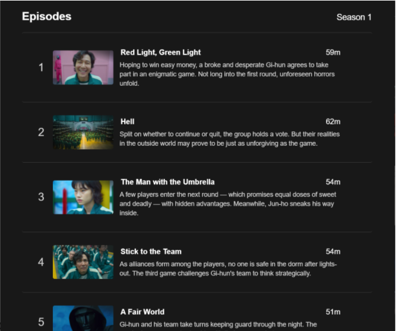
 

### 🚩 Checkpoint : Game 1

If we want to recreate Netflix's episode list, we need to start from scratch by creating a completely new React project! In this game, you have some tasks to do:
- Create a new folder in an easily accesible accessible location like your Desktop and name the folder something like `hackschool-s4`. 
- Then you want to open VSCode in that new folder that you just created. 
- Open the terminal (it's on the top bar of VSCode if you can't find it). For Window's it's ``Ctrl + ` ``
- Run the command `npx create-react-app netflix-clone` similar to how you did last week
- If the command finished and succeeded, then you should be able to type `npm start` to see the default React app. 

### Breaking down the Netflix Episode List

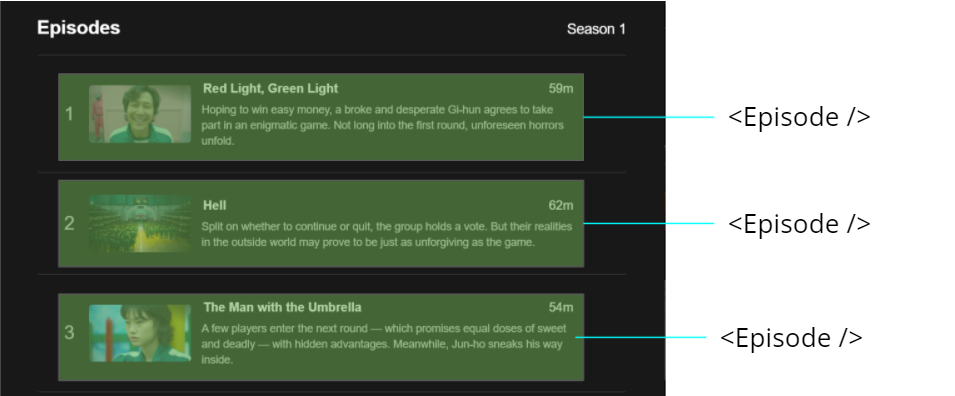

Let's look how we can recreate this episode list. From a glance, we see that we can split the episode list into each invidual "Episode" that look almost identical to each except that they have different content. 

Hence, if we create a new `EpisodeList.js` component, it may look something like this.

```js
// In EpisodeList.js

import React from 'react';

function Episode() {
    return (
        <div></div>  // currently just returns an div/box
    );
}

function EpisodeList() {
     // In our episode list, return a bunch of episode components!
    return (
        <div>
            <Episode /> 
            <Episode />
            <Episode />
        </div>
    );
}

export default EpisodeList;
```

This method of creating components shouldn't be unfamiliar to you from last week. Here, we created two components, one is the `Episode` component, which is empty for now. The second component that we created is `EpisodeList`, which simply returns/renders a bunch of `Episode` components. Finally, since we need our `App.js` to be able use our `EpisodeList`, we need to `export` it. 

Then, our `App.js` will look something like this:

```js
import EpisodeList from './components/EpisodeList.js';

function App() {
  return (
    <div className="App">
      <EpisodeList />
    </div>
  );
}
```

Wow! So empty! That's right, I got rid of almost all of the `App` component's original content because we don't need it anymore. What's important here is that we imported `EpisodeList` from wherever the `EpisodeList.js` file is, and then we used our component like so: `<Episode />`.

Yay! While our website is still empty, we managed to set up a barebones `EpisodeList`. 

### 🚩 Checkpoint : Game 2

In this game:
- Create a 'components' and 'images' folder 
- In the 'components' folder, create a new file called `EpisodeList.js`
- Set up a bare bones `EpisodeList.js` like I just showed
- Modify `App.js` to display your bare bones `<EpisodeList />`!

### Breaking down the Netflix Episode Component

Now let's try breaking down each episode down. 

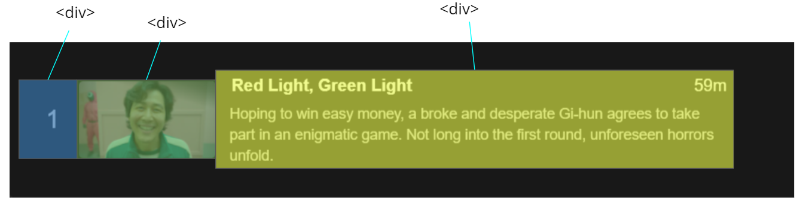

From a very high level, we can break an "Episode" component into 3 big blocks, they seem to be boxes that contain various different content. Hence, it would be good to assume that they could be recreated with some sort of `<div>` tag.

Now if we further dive into each box:

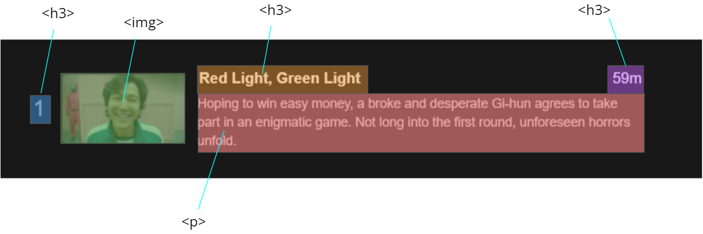

We see that we can further divide up the content inside of each `<div>` tag. Now that we are back to our familiar vanilla HTML tags like `<h3>, ` etc, this gives us a basis to start creating our Episode component!

After some recreating the Episode component just like we broke it down, we see that our `Episode` component looks like this: 

```js
import squidGame1 from '../images/squid-game-1.jpg';

function Episode() {
    return (
        <div>
            <div><h3>1</h3></div>
            <div>
                
            </div>
            <div>
                <h3>Red Light, Green light</h3>
                <p>
                    Lorem ipsum dolor sit amet, consectetur adipiscing elit, sed do eiusmod tempor incididunt ut labore et dolore magna aliqua. Ut enim ad minim veniam, quis nostrud exercitation ullamco laboris nisi ut aliquip ex ea commodo consequat.
                </p>
            </div>
        </div>
    );
}
```

Since you should already be familiar with this from Week 1 HTML, we won't dive into it too much. One thing of note is the way we imported the image and used it in the `` tag. This is another example of JSX: We imported an image as a 'JavaScript' variable and then used it programmatically in our HTML.

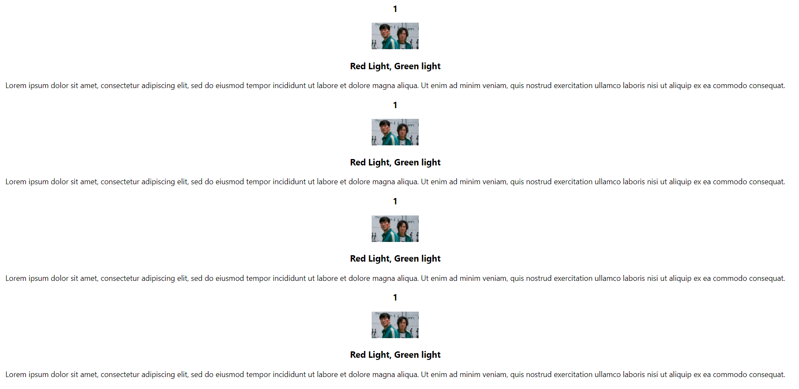

Now, our website should look something like this. Not bad! At least for one episode, we got the content down, and it looks sort of similar to what Netflix does because we analyzed the possible tags that they could have used and then used it in our clone. 

### 🚩 Checkpoint : Game 3

In this game, your tasks are:

- Make your own `<Episode />` component for any tv show that you like!
- Feel free to copy as much of my code as you like!
- Your end result should look somewhat like mine! 
- Don't worry about styling and the positioning of the text and images!

### What is Props?

After coding our Episode List, we've realized a problem, and that is that making a new Episode becomes quite tedious. Currently, all of the `Episode`s in our `EpisodeList` look exactly same. 

Let's say that you were working at Netflix; Squid Game comes out with a new episode, and you are in charge of updating the website to contain episode. How would you do it? Well, a naive approach would be to create an entirely new component <Episode2 /> component.

```js
function Episode1() { 
  // same as our <Episode />
}

function Episode2() {
  return (
        <div>
            <div><h3>2</h3></div>
            <div>
                
            </div>
            <div>
                <h3>Hell</h3>
                <p>
                    Lorem ipsum dolor sit amet, consectetur adipiscing elit, sed do eiusmod tempor incididunt ut labore et dolore magna aliqua. Ut enim ad minim veniam, quis nostrud exercitation ullamco laboris nisi ut aliquip ex ea commodo consequat.
                </p>
            </div>
        </div>
    );
}

function EpisodeList() {
  return (
        <div>
            <Episode1 /> 
            <Episode2 />
        </div>
    );
}

```

However, as we can see, this naive approach is too tedious, it wastes lots of code and lots of time. Which means more work for you! If you don't want to get fired by Netflix, you better start using **Props**. But what is it?

Props are how we can pass data from one component to another. This means that:

- Instead of each component having hard-coded content
- We give it to the component input
- The component will use that input to generate a different result
- This allows us to reuse A LOT of code

Props are a core part of React Components, and are a key reason as to why they are so powerful. 

#### An Analogy: Functions

To better help us understand Props, let's take a look at JavaScript functions as an analogy. Take the following `sayHello` function. 

```js
function sayHello(name) {
	console.log('Hello, ' + name.last + ' ' + name.first);
}
```

This function simply takes in a `name` object and will print out `name.last` and `name.first`. 

Thus, we would expect to use it like this:

```js
sayHello({first: 'Gi-hun', last: 'Seong'});  
// Hello, Seong Gi-hun

sayHello({ first: 'Sae-byeok', last: 'Kang'});  
// Hello, Kang Sae-byeok
```

Notice that although we are calling the same function twice, because we passed in two different objects into the function, we get a different behaviour or output. 

But wait. This sounds exactly like Props: by passing different data into the same component, the component is able to generate a different result. 

Now if we try to remember, how did we teach you to create React components? That's right! React components are made by creating **FUNCTIONS**. We create a function whose name is the name of the component that we want to make, and then we export it. 

> So the intuition is: If JavaScript functions can use **arguments** as a form of input to do different things, then why can't React components?

So now the question is, we know how to pass arguments into functions, but how do we pass arguments into components?

#### You've seen Props being used before
The truth is, you've all already used Props before in our previous sessions, but we've never told you. 

```js

```

Remember the `` tag that we first introduced to you in session 1? Well, it seems that the `` tag does exactly what we just described: Even though we are using the same `` tag, if we pass in different images into the `src` property, then we get a different image displayed, similarly, if we pass in a different strings into the `alt` property, then we get a different alt text for that image.

Again, we see the same idea: Although we are using the same tag/component/function, by passing in different data as input, we get a different result. 

Well we didn't tell you, but `src` and `alt` are actually Props! So we've been using them the whole time!

> `src` and `alt` are actually Props! 

Now let's see how we can make our own components use Props too!

### How to define Props

Using Props in React is very similar as how we did it for the `` tag. 

```js
// In EpisodeList

<Episode
  prop1="1"
  prop2="Red light, Green light"
/>
```

As seen, if we want to pass some data into a component, which in this case is the `<Episode />` component, then we just need to add `propName={The data that you want to pass in}` inside the tag of the component. Note that `propName` can be named anything, and the data that you want to pass in can be any JavaScript value or variable.

Now, if we want our `<Episode />` component to use this data that we passed in, we need to do something special. 

```js
function Episode(props) {
  return(
    /* JSX code here */
    <h3>{props.prop1}</h3>
    <p>{props.prop2}</p>
  );
}
```
First, we add in a new argument into our function declaration: A `props` argument, which is just a JavaScript Object that contains all the props that was passed into to the component. In this case, since we passed in `prop1="1"` and `prop2="Red light, Green light"`, we can simply access the values using `props.prop1` and `props.prop2`. 

### Applying this to our EpisodeList

With all of this knowledge under our belts, we can now try to make our EpisodeList use Props too.

First, things first, is to pass our data into each `<Episode />` component as props. So in our `EpisodeList` component:

```js
import squidGame1 from '../images/squid-game-1.jpg';
import squidGame2 from '../images/squid-game-2.jpg';
import squidGame3 from '../images/squid-game-3.jpg';
import squidGame4 from '../images/squid-game-4.jpg';

function EpisodeList() {
  return (
    <Episode 
      episodeNum="1"
      title="Red Light, Green Light"
      thumbnail={squidGame1}
      description="Lorem ipsum dolor sit amet, consectetur adipiscing elit, sed do eiusmod tempor incididunt ut labore et dolore magna aliqua. Ut enim ad minim veniam, quis nostrud exercitation ullamco laboris nisi ut aliquip ex ea commodo consequat."
    />
    <Episode 
      episodeNum="2"
      title="Hell"
      thumbnail={squidGame2}
      description="Lorem ipsum dolor sit amet, consectetur adipiscing elit, sed do eiusmod tempor incididunt ut labore et dolore magna aliqua. Ut enim ad minim veniam, quis nostrud exercitation ullamco laboris nisi ut aliquip ex ea commodo consequat."
    />
    <Episode 
      episodeNum="3"
      title="The Man with the Umbrella"
      thumbnail={squidGame3}
      description="Lorem ipsum dolor sit amet, consectetur adipiscing elit, sed do eiusmod tempor incididunt ut labore et dolore magna aliqua. Ut enim ad minim veniam, quis nostrud exercitation ullamco laboris nisi ut aliquip ex ea commodo consequat."
    />
    <Episode 
      episodeNum="4"
      title="Stick to the Team"
      thumbnail={squidGame4}
      description="Lorem ipsum dolor sit amet, consectetur adipiscing elit, sed do eiusmod tempor incididunt ut labore et dolore magna aliqua. Ut enim ad minim veniam, quis nostrud exercitation ullamco laboris nisi ut aliquip ex ea commodo consequat."
    />
  );
}
```

So what did we do? We passed in four props to each `<Episode />` component: `episodeNum`, `title`, `thumbnail`, and `description`. Each containing the data corresponding to each episode. Note that the four images are different images that I found on Google. 

Now, all that's left is to change our `<Episode />` component to use these props instead of hard coded content. 

```js
function Episode(props) { // ✅
    return (
        <div className='episode-container'>
            <div className='episode-number'>
                <h3>{props.episodeNum}</h3> // ✅
            </div>
            <div>
                 // ✅
            </div>
            <div className='episode-information'>
                <h3>{props.title}</h3> ✅
                <p>
                    {props.description} // ✅
                </p>
            </div>
        </div>
    );
}
```

There! All we did was add `props` as an argument to our function, and then we replaced all of our hardcoded content with `props.propName`. 

Now, our website looks like this!

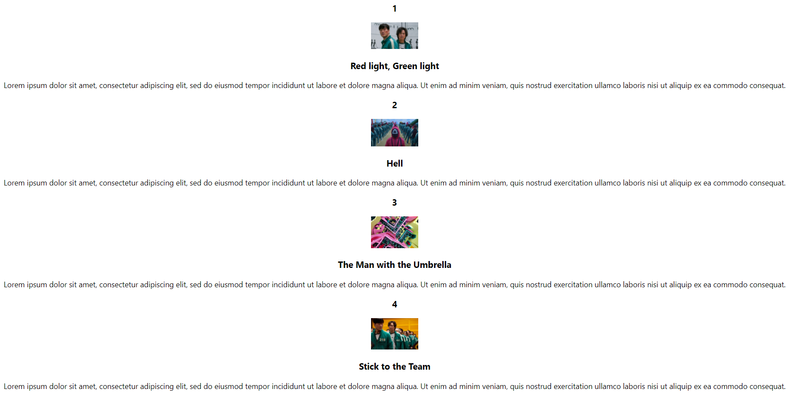

### 🚩 Checkpoint : Game 4

In this game, your tasks are:

- Convert your `<Episode />` component to use Props!
- Again, feel free to use as much of my code as you like
- Well done! You have successfully incorporated Props in your website!

### Using `Array.map()`


Let's say that you call in sick one day at the office and your coworker steps in to help you. Suddenly, Squid Game comes out with a new episode and they need to update it on their website. However, that coworker has no idea how props work and all that: all they know is basic JavaScript! 

To solve this problem, we can use `Array.map()` to further make our code much more simpler and easier to maintain and read. 

In our `EpisodeList` component, we define an array of objects containing the data for all of the episodes for Squid Game. 

```js
const fillerText = "Lorem ipsum dolor sit amet, consectetur adipiscing elit, sed do eiusmod tempor incididunt ut labore et dolore magna aliqua. Ut enim ad minim veniam, quis nostrud exercitation ullamco laboris nisi ut aliquip ex ea commodo consequat.";

const episodes = 
[
    {
        episodeNum: 1,
        title: "Red light, Green light",
        thumbnail: squidGame1,
        description: fillerText
    },
    {
        episodeNum: 2,
        title: "Hell",
        thumbnail: squidGame2,
        description: fillerText
    },
    {
        episodeNum: 3,
        title: "The Man with the Umbrella",
        thumbnail: squidGame3,
        description: fillerText
    },
    {
        episodeNum: 4,
        title: "Stick to the Team",
        thumbnail: squidGame4,
        description: fillerText
    }
];
```

Now, all we need to do, is map each item in this array, to an `<Episode />` component with props corresponding to each item in the array. The way we do this, is with some fancy JSX code with `Array.map()`:

```js
const allEpisodeComponents = episodes.map((e) => { 
  // e is every element in the episodes array
        return (
            <Episode 
                episodeNum={e.episodeNum}
                title={e.title}
                thumbnail={e.thumbnail}
                description={e.description}
                key={e.episodeNum}
            />
        );
    });
```

Now, all we need to do, is `return` our new list of Episodes: `allEpisodeComponents` and then we are done!

```js
return (
        <div>
            {allEpisodeComponents}
        </div>
    );
```

Although our website still looks the same, it is much more simpler and easier to read. Your coworker can easily update this with just knowledge of JavaScript Arrays and Objects!

### 🚩 Checkpoint : Game 5

- Put all of the data for each `<Episode />` in an array.
- Use the `array.map` function to create our `EpisodeList`.

## Layout

Our Netflix episode list has all the content of the actual
Netflix list, but is missing all the looks of the actual
one. 

To create our Netflix clone, we must use the magic of
CSS. However, the CSS we've learned so far doesn't cut
it. We're going to learn about some CSS properties that
help us determine how elements are positioned on a webpage
today.

### Layout: `display`

The CSS `display` property of an element will determine 
how that element will position itself relative to other
elements around it.

By default, items like `div` are given the property 
`display: block`. This means that the width and height of the
`div` are preserved and there is a newline automatically
inserted after the `div`.

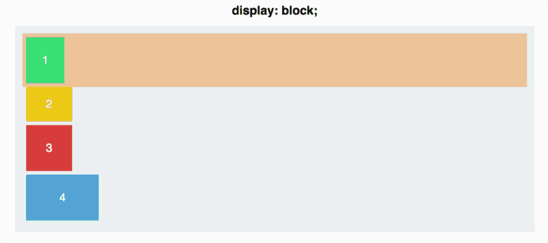

_GIF Source: [Medium article](https://medium.freecodecamp.org/an-animated-guide-to-flexbox-d280cf6afc35)_

The display also has a few other properties that vary
how elements position themselves relative to others around
them.

Here is a graphic showing some of the differences:


_Source: [Stack Overflow](https://stackoverflow.com/questions/9189810/css-display-inline-vs-inline-block)_

We can see that `display: inline-block` is that same as
`display: block`, but there is no newline inserted after
an element. 

For `display: inline`, the top and bottom margins are 
ignored. The width and height of each element are also ignored,
and these elements sit side-by-side, spacing permitting.

> Each HTML element by default will have a default `display`
> property. `<p>` and `<div>` tags have a default 
> `display: block` property. Images have a default
> `display: inline` property, but its default width
> and height are intrinsic to the images values, so it
> behaves as if it had the style of `display: inline-block`.

### Limitations

Although it seems we have a lot of options, we are actually
very limited with what we have right now with `inline`,
`block`, and `inline-block`. 

Try thinking of how you could do the following things:

1. Create a row evenly spaced divs that adapts to any
screen size.
1. Create a column of divs evenly spaced apart.
1. Align all blocks in a row to the right side.

It is possible to mess with margins to get some of these,
but we run into trouble when we adjust the size of our
screen or window that our webpage is in.

So how do we solve this? We use something called _Flex Box_.


### Flexbox

Before we introduce flex box, we have to talk about a
very important relationship in CSS. The parent-child 
relationship. 


> Not this this one.

Let's say I'm trying to recreate the Squid Game card
in my code to look something like this:

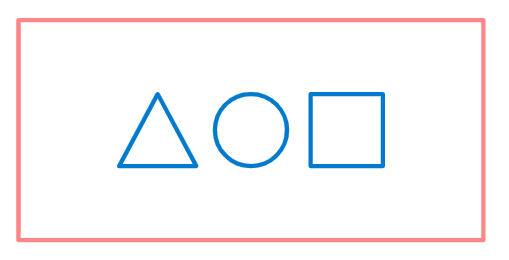

My code for this will look something like the following
```js
<div>
  // assume I have defined these react components somewhere else
  <Triangle />
  <Circle />
  <Square />
</div>
```

In this example, the parent element is the `div` and the
child elements are the `Triangle`, `Circle`, and `Square`. 

So what are parent and child elements then?

Parent elements are elements that contain elements inside
of them. Think of them like containers that wrap around
the inner elements.

Child elements are the elements inside any given parent
element. 

```js
<div> // parent
  <Triangle /> // child
  <Circle /> // child
  <Square /> // child
</div>
```

Now that we have learned what parent and child elements
are in HTML, we can use flexbox.

Flex box gives parent elements the ability to control
the positions of the child elements inside of them.

For example like the example above, if I want to 
get the `Triangle`, `Circle`, and `Square` to be
evenly spaced in a row, I can apply some CSS properties
to the parent `div`. These new properties will control
the positions of the shapes inside the `div`. 

To unlock this magical ability though, we first have
to give the parent element the property
```css
display: flex;
```

By using this property called `flex`, we have unlocked
a few other properties that we can use now to use
flexbox. 

### Alignment Axes

When we are position child elements, we typically are
concerned about the directions up/down and left/right.

But depending on how you tilt your head when you look 
at the screen, what exactly counts as up/down left/right?

To solve this problem, we'll instead use something called
the _main axis_ and _cross axis_.

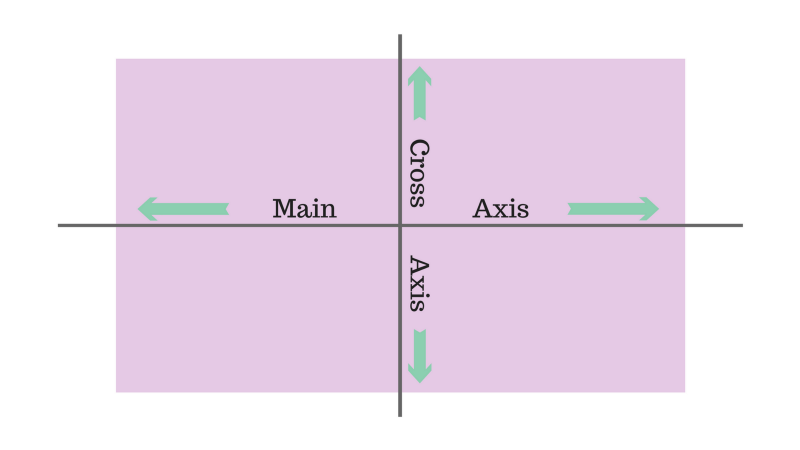

_Source: [freecodecamp.org](https://www.freecodecamp.org/news/an-animated-guide-to-flexbox-d280cf6afc35/)_


The image above shows the _default_ orientation of the
main axis and the cross axis. By _default_ the main
axis is horizontal on the screen and cross axis is 
vertical, perpendicular to the main axis.

But this is just the default orientation. How do we determine
the direction of the main and cross axis?

The answer is another property called `flex-direction`. The
values this property can take are `row`, `column`,
`row-reverse`, and `column-reserve`. The value determines
the direction of the _main axis_. 

If we use
```css
flex-direction: row;
```
This matches our default main axis, with items being placed
in a row from left to right.

If we use
```css
flex-direction: row-reverse;
```
This will also form a row, but items will be placed in reversed
going from right to left.

If we use
```css
flex-direction: column;
```
This will put the items into a column. For `column-reverse`
we will get a column, but with the items in reverse order.

To get an idea of what this looks like, here is a GIF
of the property.

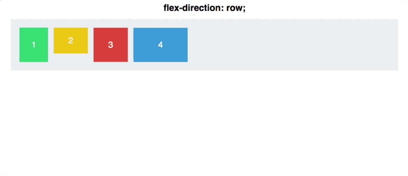
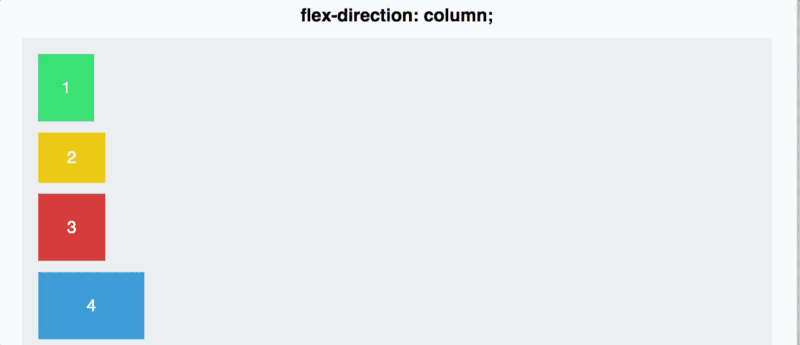

_Source: [freecodecamp.org](https://www.freecodecamp.org/news/an-animated-guide-to-flexbox-d280cf6afc35/)_


Now that we have defined our axis directions, we can define
the placement of child elements along these axes.

The `justify-content` property determines the placement
of child elements along the _main axis_. The following
values it can take are `flex-start`, `flex-end`, `center`, 
`space-around`, `space-between`, and `space-evenly`. 

These look like the following:

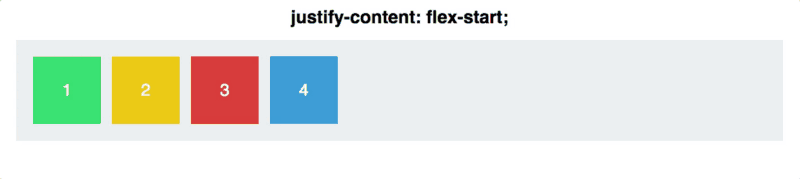

_Source: [freecodecamp.org](https://www.freecodecamp.org/news/an-animated-guide-to-flexbox-d280cf6afc35/)_


The `align-items` property determines the placement of
child elements along the _cross axis_. It can take the 
following values: `flex-start`, `flex-end`, `center`,
`stretch`, and `baseline`. 

These look like the following: 

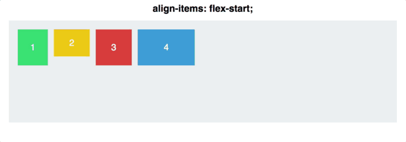

_Source: [freecodecamp.org](https://www.freecodecamp.org/news/an-animated-guide-to-flexbox-d280cf6afc35/)_

There is also an `align-self` property, that when applied
to a particular child element (not the parent), can override
the `align-items` property from the parent.

This looks something like this:

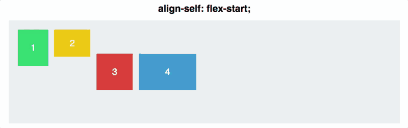


### Practice

These new properties will start making a lot more sense
if you get some hands on practice.

I highly recommend using this website called
[flexboxfroggy.com](https://flexboxfroggy.com/). This is how
I (Jody) learned flexbox and its a really good resource
to practice it.

Before we move on, take 15 minutes to try it out for yourself.


### Applying Flex Box to Netflix

Now that we've learned flexbox, we can finally add flex
to our episode list.

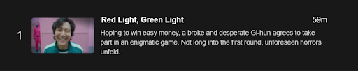

If we examine this component, we can see that the entire
episode container really contains 3 child containers.

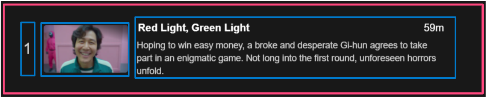

We can see that the following properties are applied to the 
parent container: 

```css
display: flex;
flex-direction: row;
justify-content: center;
align-items: center;
```

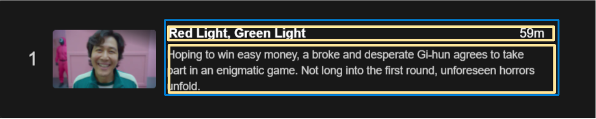
Within the episode description itself we can also see
that the title line and description are also in a `column`
`flex-direction`. The CSS for this would look like this:

```css
display: flex;
flex-direction: column;
```

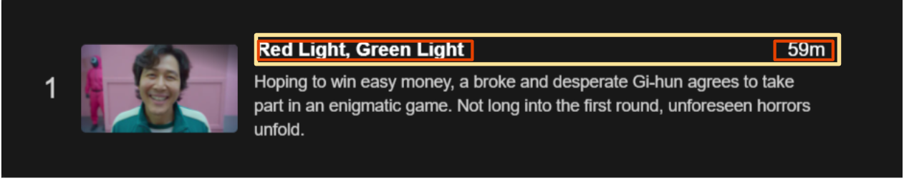

Within the title line, we can see that there must be following
flex properties on the title and time parent container as well:

```css
display: flex;
flex-direction: row;
justify-content: space-between;
```

If we add the following CSS classes
```css
// Episode.css
.episode-container {
  /* FLEXBOX */
  display: flex;
  flex-direction: row;
  justify-content: center;
  align-items: center;
}

.episode-information {
  /* FLEXBOX*/
  display: flex;
  flex-direction: column;

  /* other styling */
  width: 70%;
  text-align: left;
  padding: 8px;
}
```

Then in our `EpisodeList.js` file, we can import the
CSS file and apply the classes to the relevant html
tags.

```js
import React from 'react';

import SquidGame1 from '../images/squid-game-1.jpg';
import SquidGame2 from '../images/squid-game-2.jpg';
import SquidGame3 from '../images/squid-game-3.jpg';
import SquidGame4 from '../images/squid-game-4.jpg';

import './Episode.css';

function Episode(props) {
    return (
        <div className='episode-container'>
            <div className='episode-number'>
                <h3>{props.episodeNum}</h3>
            </div>
            <div>
                
            </div>
            <div className='episode-information'>
                <h3>{props.title}</h3>
                <p>
                    {props.description}
                </p>
            </div>
        </div>
    );
}

// .. the rest of the file
```

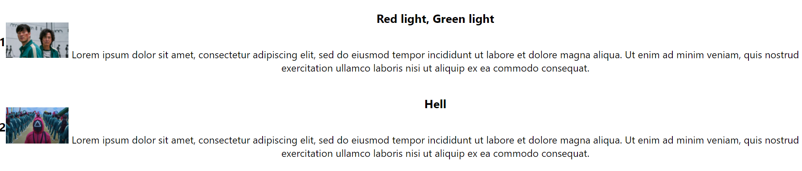

This looks a lot like the real netflix episode list, minus
some other styling.

After we touch that up with the full CSS file though 
it looks pretty good!

```css
.episode-container {
  /* FLEXBOX */
  display: flex;
  flex-direction: row;
  justify-content: center;
  align-items: center;
}

.episode-information {
  /* FLEXBOX*/
  display: flex;
  flex-direction: column;

  /* other styling */
  width: 70%;
  text-align: left;
  padding: 8px;
}


/* other styling */

.episode-number {
  padding: 8px;
}

body {
  background-color:rgb(14, 14, 14);
  color: white;
}

h3 {
  margin: 4px 0px;
}

img {
  padding: 8px;
}

p {
  margin: 4px 0px;
}
```

And here's the final product!

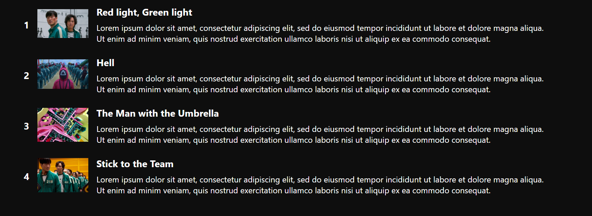