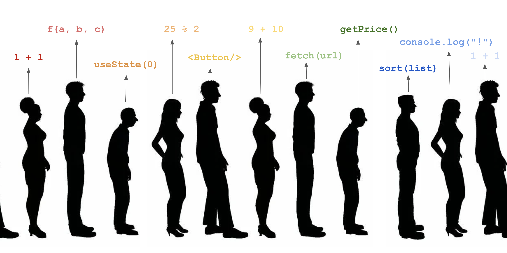
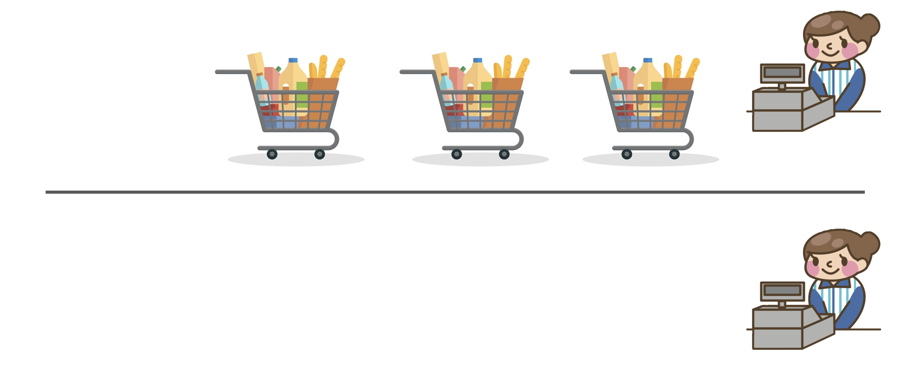

# Hacksprint Session 6: Asynchronous Programming and Web API's

**Date**: November 10, 2021

**Location**: Zoom

**Teachers**: [Einar Balan](https://github.com/EinarBalan)

## Resources

- [Slides](https://docs.google.com/presentation/d/1DiJ4Zpc0lm3BG1aNATqC9zNDATfzk8h9CRJjf1bFZ18/edit#slide=id.ga38c9ed0bc_0_53)
- [ACM Membership Attendance Portal](https://members.uclaacm.com/login)

## What we'll be learning today
- [What is Asynchronous Programming?](#what-is-asynchronous-programming)
- [Promises](#promises)
- [Async/Await](#asyncawait)
- [JSON](#json)
- [API's and fetch()](#apis-and-fetch)

## What is Asynchronous Programming?

### Motivation for Async
You may not have realized it, but up until this point, you've been writing something called **synchronous** code. In synchronous code, each function or expression within your program is executed one at a time and in sequential order. 

A more digestible way to think about it: all of the expressions in your code are waiting in line, but they have to wait their turn to be executed! The result: each task in your program (no matter how long it takes) is executed one by one.



And this is fine for a simple program where each task is completed super quickly! But what happens when a task is super resource intensive and takes a long time to complete? Well, if written synchronously, all the tasks that come after the resource hog will be stuck waiting for it to wrap up. This could potentially lead to a terrible UX, which we definitely don't want! How can we avoid that?

### Async in Practice
Enter async programming. Essentially what async programming allows us to do is add more "lines" so that more than one expression can be executed at a time. 

Imagine you're at the grocery store and you see this: 

Two lines: to your left there are 3 carts filled with tons of stuff and to your right nobody is in line.


Which line are you more likely to take? Obviously the empty one, right? On the left the shopper has all this garbage loaded into their carts and you have no idea how long it's going to take to scan each thing. If you get in line behind them, you could be waiting for hours. By taking the empty line, you save a lot of time! 

Now imagine instead of shoppers waiting in line, we have tasks in our program waiting to be executed. We want each task to get going as quickly as possible, and we don't want to keep them waiting.

Async solves this problem! If there is ever some task that could take a long time, but you're not sure how long (say a network request) you don't want to freeze up your application while waiting for it to complete! Async allows us to execute more than one expression at a time, so we no longer have to wait for the intensive task to complete before moving onto other things. 

## Promises
Alright, so now that you know what asynchronous programming is, let's get into how you might actually use it in the context of a React Native app. 

### Motivation for Promises

Let's say we have a function `simulateIntensiveTask()` that takes some amount of time to complete. When the task is completed, we should see a message in the console. The return value of the function is how long the task took to complete! Let's add the following to `handlePress()` to demonstrate a common problem:

```javascript
const handlePress = () => {
    simulateIntensiveTask();
}
```

When we click the button, our whole UI freezes up! If you look closely, you'll notice that React Native doesn't even realize we pressed the button until after the task is completed. This is terrible UX, and it's all happening because `simulateIntensiveTask()` is a synchronous function. As I explained before, in synchronous code each expression is executed one at a time so all expressions after our intensive task have to wait until they can get started! To emphasize that this is the case,

```javascript
const handlePress = () => {
        const seconds = simulateIntensiveTask();
        console.log("No more tasks left!");
        console.log("Total milliseconds: " + 1000 * seconds);
}
```

As expected, the task takes a couple seconds to complete and the logs are only shown after the task is completed. Let's instead use an async function.

```javascript
const handlePress = () => {
    simulateIntensiveAsyncTask();
}
```

Now our app doesn't freeze while waiting for the task to get completed, awesome! Let's make absolutely sure that our function is asynchronous.

```javascript
const handlePress = () => {
        const seconds = simulateIntensiveAsyncTask();
        console.log("No more tasks left!");
        console.log("Total milliseconds: " + 1000 * seconds);
}
```

But this results in something unexpected: why is the number of milliseconds NaN? And also, why is "The task took 3.32 seconds to complete. That was intense!" logged after the milliseconds log? Didn't we call `simulateIntensiveAsyncTask()` first? What is going on?

Since `simulateIntensiveTask()` is asynchronous, which makes sense because our code is running out of order! The function doesn't freeze ours program and allows for all of the expressions that come after it to be executed before the task is completed. This leads to a problem, though: we don't yet know our seconds value when we log the number of milliseconds! To try to get to the bottom of this, let's take a couple steps back and just log our seconds value.

```javascript
const handlePress = () => {
    const seconds = simulateIntensiveTask();
    console.log(seconds);
}
```

This results in some scary looking think being output to the console: 

```
Promise {
  "_U": 0,
  "_V": 0,
  "_W": null,
  "_X": null,
}
```

Now we know why our example before output NaN, because that is *definitely* not a number. In fact, it's a promise!

### What is a Promise?
A promise is essentially just a wrapper for a value that might be unknown when the promise is created. In the previous example, when we log the number of seconds, we don't yet know how long the task took to complete, so the `seconds` variable must be a promise! That's why when we log `seconds` it prints out what we saw before, rather than a number.

That's great and all, but how can we actually get the value that we want (this is called resolving the promise)? We have a couple ways we can approach it. One is to use `.then()` which can be called on a promise.

Going back to our `simulateIntensiveTask()` example, since (as I mentioned before) the function returns a promise we can use `.then()` as follows:

```javascript
const handlePress = () => {
    simulateIntensiveAsyncTask().then(seconds => {
        console.log(seconds);
    })
}
```
What we pass into `.then()` is just a function that takes the resolved value of the promise (i.e. the value after we figure out what it is) as a parameter and then does whatever we want to do with it (in our case logging it to the console).

Alright, awesome! Now everything works as expected. 

## Async/Await
`.then()` is great, but it can get out of hand *really* quickly if you have a couple nested asynchronous actions. Lets instead explore a way of resolving the promise that is a little easier on the eyes, the glorious async/await: 

```javascript
const handlePress = async () => {
    const seconds = await simulateIntensiveAsyncTask();
    console.log(seconds);
}
```

Much cleaner right! Async/await lets you resolve promises while still writing your code in a way that looks similar to synchronous code. It's important to realize that under the hood we are still using promises when using async/await, but our syntax is just a lot nicer! I'll be using async/await for the rest of this workshop. 

Another important thing to note: the `await` keyword can only be used within functions that are declared asynchronous!

Alright, up to this point I've just been simulating intensive tasks, but how might we use async in the real world? Let's take a look.

## JSON
But first, let's do some review of an important Javascript concept: objects!

### Objects

Say we want an object that represents a certain cryptocurrency. Each cryptocurrency has a name, a current price, and a percentage that represents the change in its price over the last 24 hours. To do so we could write the following: 

```javascript
dogecoin = {
    price: 0.0592,
    change: 28.61,
};
```

To get each value within our object we can write the following:

```javascript
const price = dogecoin.price; // equals .0592
const change = dogecoin.change; //equals 28.61
```

OR


```javascript
const price = dogecoin["price"]; //equals .0592
const change = dogecoin["change"]; //equals 28.61
```

We can also have objects within objects!

```javascript
dogecoin = {
    price: 0.0592,
    tracker: {
        day: 28.61,
        week: 102.15,
        month: 504.77,
        year: 2009.38,
    }
};
```

And we can access values within that object in exactly the same way as shown above.

```javascript
const yearlyChange = dogecoin.tracker.year;
```

### Object Notation
Very often, it's useful to store these objects as string representations. This string representation of a javascript object is known as JSON, or JavaScript Object Notation. Converting from a JSON value to an object is really easy! To demonstrate here's what our `dogecoin` object would look like as JSON.

```JSON
{
"dogecoin": {
    "price": 0.0592,
    "tracker": {
        "day": 28.61,
        "week": 102.15,
        "month": 504.77,
        "year": 2009.39,
        }
    }
}
```

Pretty similar, right? That's what makes JSON so convenient. 

Alright, now that we know what async programming is, how to use it in Javascript with Promises and async/await, and what JSON is, let's put it all together!

## API's and fetch()
An example of an intensive task in the real world would be a network request. A **network request** is a way to get data that isn't stored locally over the internet (i.e. from a server). Very often, we use something called an **API** to interface with these servers! API's are very powerful in that they let use access data in an easy way! Using an API, we don't have to worry about all the details of how that data was produced, all we need to worry about is how we want to use it.

In order to trigger a network request in Javascript, we use the `fetch()` function. `fetch()` takes an API URL as a parameter and returns a promise (since we don't know how long it's going to take to get the data that we requested!). Since it returns a promise, we're going to have to resolve that promise in order to access the data we want! I'm going to use async/ await

```javascript
// within an async function
const result = await fetch('https://someurl.com/the-location-of-your-data');
```

After the promise is resolved, there is still one last step! We need to convert the returned object to a Javascript object using `.json()`, another asynchronous function.

```javascript
// within an async function
const result = await fetch('https://someurl.com/the-location-of-your-data');
const object = await result.json();
```

Now, we can access our requested data. Let's show how you might do this in a real project.

### Demo
Lately, the stock market and cryptos have been really popping off so I want to make an app that let's me keep track of my ~sound~ investments! Let's call it RobinPeople, *the people's dogecoin tracker.*

I took the liberty of setting up some starter code so we can focus on just the async stuff. Feel free to download it and mess around!


Let's make it so that when we press the update button, the price text is updated with the current price of dogecoin! We can do this using the fetch function. In order to get the current price, we're going to use an API from coingecko.com, a website that tracks cryptocurrency prices. 

It can be accessed through the following link: [https://api.coingecko.com/api/v3/simple/price?ids=dogecoin&vs_currencies=usd&include_24hr_change=true]('https://api.coingecko.com/api/v3/simple/price?ids=dogecoin&vs_currencies=usd&include_24hr_change=true')

If you open this URL in the browser, you will get something that looks like this:

```json
{
  "dogecoin": {
    "usd": 0.052405,
    "usd_24h_change": 62.493060243475654
  }
}
```

```javascript
const dogeCoinApiUrl = 'https://api.coingecko.com/api/v3/simple/price?ids=dogecoin&vs_currencies=usd&include_24hr_change=true';

const RobinPeople = () => {
    const [price, setPrice] = useState(0);

    const updatePrice = () => {
        const result = await fetch(dogeCoinApiUrl);
        const json = await result.json();
        setPrice(json.dogecoin.usd);
    }

    return (
        <SafeAreaView style={styles.container}>
            <Text style={styles.title}>RobinPeople</Text>
            <View style={styles.priceContainer}>
                <Text>DOGE</Text>
                <Text style={styles.price}>${price.toFixed(4)}</Text>
                <MoneyButton 
                    onPress= {updatePrice}
                    title="Update"
                />
            </View>
        </SafeAreaView>
    );
}
```

Alright, this is working pretty nicely! 

