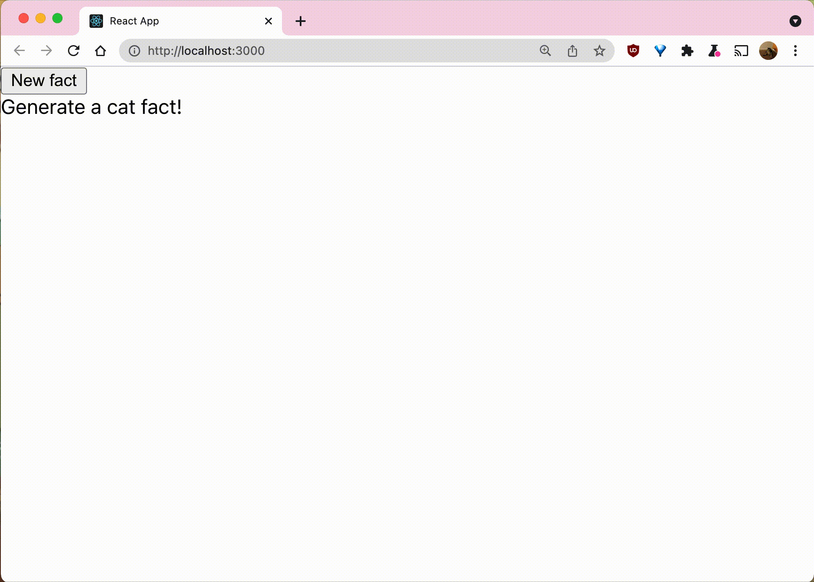
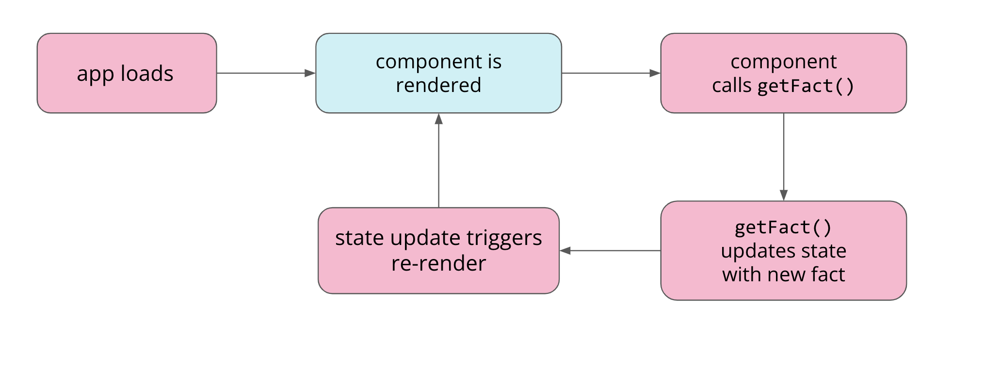
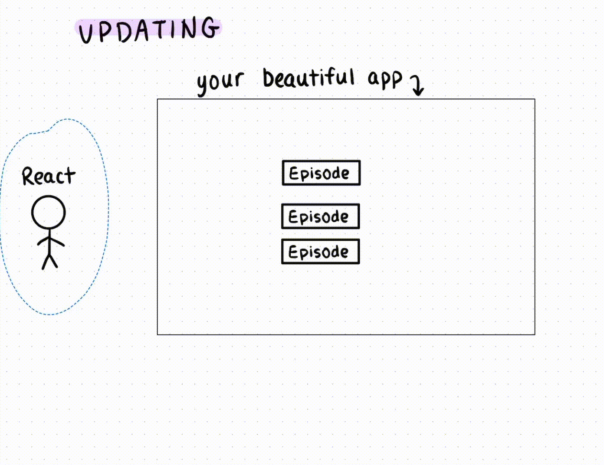
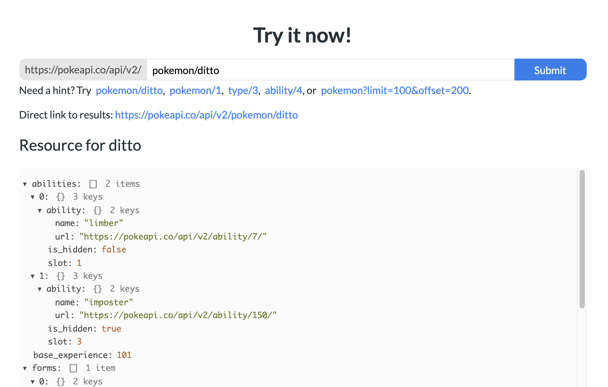
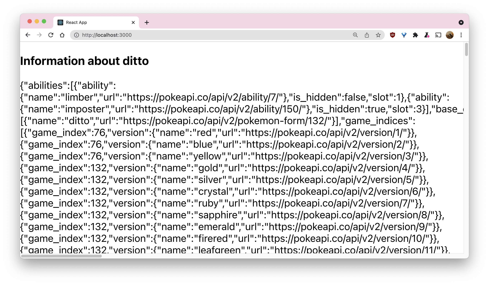
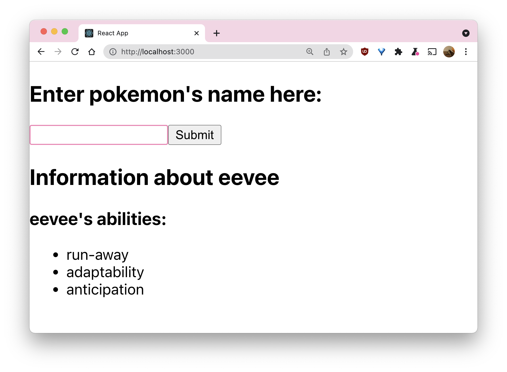

# Hackschool Session 7: React Lifecycle

**Date**: November 17, 2021

**Location**: Perloff Hall 1102

**Teachers**: [Jamie Liu](https://github.com/jamieliu386)

##  <a id='resources'></a>Resources

- [Slides](https://docs.google.com/presentation/d/17aHHxXlZU3Z41GkOuie01CO5lXqk-2qebzNnSoEfZ50/edit?usp=sharing)
- [ACM Membership Attendance Portal](https://members.uclaacm.com/login)

---

##  <a id='topics-for-today'></a>Topics for today

* [🚩 Checkpoint: Create your workspace](#🚩-checkpoint:-create-your-workspace)
* [Recap](#recap)
  * [🚩 Checkpoint: fetch data from an API](#🚩-checkpoint:-fetch-data-from-an-api)
  * [Limitations](#limitations)
  * [Solution(?)](#solution(?))
* [React lifecycle](#react-lifecycle)
* [`useEffect`](#`useeffect`)
  * [`useEffect` syntax](#`useeffect`-syntax)
  * [`useEffect` Demo](#`useeffect`-demo)
  * [🚩 Checkpoint: integrate useEffect](#🚩-checkpoint:-integrate-useeffect)
* [More on `useEffect`](#more-on-`useeffect`)
  * [Demo](#demo)
  * [🚩 Checkpoint: integrate useEffect pt 2](#🚩-checkpoint:-integrate-useeffect-pt-2)
  * [Forms in React](#forms-in-react)
  * [Demo: React forms](#demo:-react-forms)
  * [🚩 Checkpoint: user inputs](#🚩-checkpoint:-user-inputs)
  * [App improvements](#app-improvements)
    * [Object destructuring](#object-destructuring)
    * [Error handling](#error-handling)
    * [Data presentation](#data-presentation)
    * [🚩 Checkpoint: extra improvements](#🚩-checkpoint:-extra-improvements)

---

##  <a id='🚩-checkpoint:-create-your-workspace'></a>🚩 Checkpoint: Create your workspace

To get started, create your workspace for this workshop! Create a folder, and
open it in your preferred code editor. Then, open your terminal and run the
following commands to get your React app up and running:

```sh
npx create-react-app lifecycle
cd lifecycle
npm start
```

Then, delete all the contents of the `App` function in `App.js`, we'll be
writing code here later!

##  <a id='recap'></a>Recap

[Last
week](https://github.com/uclaacm/hackschool-f21/tree/main/session-6-async-and-web-api),
we learned how to use asynchronous programming to fetch data from web APIs.

During that workshop, we made an app that calls a web API to display data when
the user clicks a button. Here's an example using a cat facts API:



Before we get into any new content, let's take a look at the code for this app
and review asynchronous programming!

```js
// App.js
import CatFact from "./components/CatFact";

function App() {
  return (
    <div>
      <CatFact />
    </div>
  );
}

export default App;
```

In `App`, all we do is import the `CatFact` component and render it.

```js
// components/CatFact.js
import React, { useState } from 'react';

const catFactEndpoint = 'https://catfact.ninja/fact';

function CatFact() {
  const [fact, setFact] = useState('Generate a new cat fact!');

  const getFact = async () => {
    const response = await fetch(catFactEndpoint);
    const json = await response.json();
    setFact(json.fact);
  };

  return (
    <div>
      <button onClick={getFact}>Get new cat fact</button>
      <div>{fact}</div>
    </div>
  );
}

export default CatFact;
```

In this file, we have some more interesting stuff going on. First, we call
`useState` to get a `fact` state variable along with the `setFact` function.

We also have an async function, `getFact`, that calls `fetch` on our cat fact
endpoint, gets the response, and stores the fact in the component's state.

Finally, we return a `div` with a `button`. The `button` calls `getFact` when it
is clicked, and the `fact` is being rendered inside of a `div` as well. So,
whenever the user clicks the button, a new fact will be fetched and displayed.

###  <a id='🚩-checkpoint:-fetch-data-from-an-api'></a>🚩 Checkpoint: fetch data from an API

- Create a `components` folder inside the `src` folder of your app
- Create a new component inside of the `components` folder that fetches data from
  an API when the user presses a button, and display the data in your app
  - Some APIs you can try: [https://catfact.ninja/fact](https://catfact.ninja/fact),
    [http://numbersapi.com/random](http://numbersapi.com/random)

Your code should look and work very similar to the cat facts app!

###  <a id='limitations'></a>Limitations

Our app is cool and all, but there's a problem: we don't show the user any data
when the app first loads, they have to press a button to see anything appear.
Imagine if you had to manually press a button to load posts on Instagram or
Twitter... Can we fix this and show the user some data when they first load the
page?

###  <a id='solution(?)'></a>Solution(?)

What if we simply add a single `getFact` call to our component? That way, we
can have the component fetch a fact to display when the app first loads, and
the user will have some content to see.

(warning: do not try this at home)

```js
function App() {
  const [fact, setFact] = useState("Generate a cat fact!");
  const getFact = async () => {...};
  getFact(); // <-- add this line to our code
  return (
    <div classid="App">
      <button onClick={getFact}>Get cat fact</button>
      <div>{fact}</div>
    </div>
  );
};
```

Well, what will happen if we run this? OH NO!!! Our app starts refreshing the
cat fact repeatedly without us pressing the button... and then just stops
showing data at all! If we open the network tab in devtools, we also see that
we're getting some sort of "Rate limit exceeded" error message.

What's happening? Recall that React automatically re-renders components when
the state changes. So, our app is doing the following, trapped in an endless
cycle of re-rendering and fetching facts:



To fix this, it would be nice if we could tell React to only get the fact the
first time the component is rendered, and not on all the re-renders...

##  <a id='react-lifecycle'></a>React lifecycle

Before we get to the actual solution, we need to understand how React components
work. There are three "phases" in a React component's life: mounting, updating,
and unmounting.

> aside: It helps me to think of a React app as a physical wall, with components
> being decorations that are "mounted" and "unmounted" from the wall. If this
> visualization helps you, awesome! If not, please bear with me for this next part...

**mounting**: this phase is when a component is **first** rendered
  
**updating**: when a component's **props or state change**, the component
  gets updated (re-rendered)
  
**unmounting**: this is when a component is **removed**, and is no longer
  being rendered
  

##  <a id='`useeffect`'></a>`useEffect`

With our understanding of lifecycle in React, we can now learn about
**`useEffect`**. This is a hook provided by React (much like `useState`) that
allows us to run pieces of code based on a component's phase its **lifecycle**.

For example, we can use `useEffect` to tell React to only run some certain code
when a component is **mounted** and not during subsequent updates.
_wink wink nudge nudge_

###  <a id='`useeffect`-syntax'></a>`useEffect` syntax

We use the `useEffect` hook by calling `useEffect` with two arguments:

```js
useEffect(callback, dependencies);
```

> Aside on dependencies: If **A** depends on **B**, B is a dependency of
> A. For example, your grade in a particular class **depends** on how you do
> on various exams, homeworks, etc. So, each exam, homework, etc. grade can be
> considered a **dependency** of your final grade

The `callback` argument is required, and is just a fancy word for the function that
contains the code we want to run.

The `dependencies` argument is an array, and is used to control when we run the
callback function as follows:

`useEffect(callback)`: if we don't pass anything in at all, the callback will
  be run after **every rendering**
`useEffect(callback, [])`: if the list is empty, the callback will only be run
  **when the component mounts**
`useEffect(callback, [a, b, c])`: if the list is non-empty, the callback will
  be run **every time the value of any dependency changes** (note: `a`, `b`, and `c`
  are variables here)

###  <a id='`useeffect`-demo'></a>`useEffect` Demo

Now, let's apply this to our cat facts app!

```js
import React, { useEffect, useState } from 'react';

const catFactEndpoint = 'https://catfact.ninja/fact';

function CatFact() {
 const [fact, setFact] = useState('Loading...');
 const getFact = async () => {...};

 useEffect(() => {
   getFact();
 }, []);

 return (
   <div classid='App'>
     <button onClick={getFact}>Get new cat fact</button>
     <div>{fact}</div>
   </div>
 );
}

export default CatFact;
```

Note the changes we've made from the last version:

- we add `useEffect` to the imports in the first line
- we add the `useEffect` call, calling `getFact` in our callback and passing an
  empty array for the dependencies list
- we also change the initial `fact` state to say `'Loading...'` as an indication
  to the user that the page is loading a fact

###  <a id='🚩-checkpoint:-integrate-useeffect'></a>🚩 Checkpoint: integrate useEffect

Your turn! Modify your app to **import** the `useEffect` hook, and call `useEffect`
in your component to fetch data for the user to see when the page first loads!

##  <a id='more-on-`useeffect`'></a>More on `useEffect`

For the rest of the workshop, we'll be making a more advanced app that accepts
user inputs and fetches data from an API using the inputs! We'll also learn
some other cool stuff and flex our React and JavaScript muscles 💪😎.

###  <a id='demo'></a>Demo

We'll start by writing a component similar to the `CatFacts` component to work off
of. However, let's find a different API to use! In particular, we'll look for one
that has endpoints that allow us to pass user inputs to the endpoint. For this
demo, I'll be using [https://pokeapi.co/](https://pokeapi.co/), a pokemon API with
many endpoints and tons of data.



I'll use the [https://pokeapi.co/api/v2/pokemon/ditto] endpoint for now. First,
I'll create a new file in my `components` folder called `PokemonInfo.js`. Then,
I will add the following code to my file. As always, we're going to import
React (and `useEffect` and `useState` while we're at it). We'll also define
a new component and make sure to export it so we can render it in the `App`.

Like the `CatFacts` component, we'll also create a constant to store our
API endpoint.

```js
import React, { useEffect, useState } from 'react';

const pokemonEndpoint = 'https://pokeapi.co/api/v2/pokemon/ditto';

function PokemonInfo() {

}

export default PokemonInfo;
```

```js
import PokemonInfo from './components/PokemonInfo.js';

function App() {
  return <PokemonInfo />
}
```

Now, let's add a state to store data from the API, and write an async function
inside of our component to fetch the data from the endpoint and store it in
the state:

```js
import React, { useEffect, useState } from 'react';

const pokemonEndpoint = 'https://pokeapi.co/api/v2/pokemon/ditto';

function PokemonInfo() {
  const [data, setData] = useState();

  const fetchData = async () => {
    const response = await fetch(pokemonEndpoint);
    const responseJson = await response.json();
    setData(responseJson);
  };
}

export default PokemonInfo;
```

Finally, let's add the `useEffect` call to fetch the data when the component mounts,
and display some information in the app!

```js
import React, { useEffect, useState } from 'react';

const pokemonEndpoint = 'https://pokeapi.co/api/v2/pokemon/ditto';

function PokemonInfo() {
  const [data, setData] = useState();

  const fetchData = async () => {
    const response = await fetch(pokemonEndpoint);
    const responseJson = await response.json();
    setData(responseJson);
  };

  useEffect(() => {
    fetchData();
  }, []);

  return (
    <div>
      <h3>Information about ditto</h3>
      <p>{JSON.stringify(data)}</p>
    </div>
  );
}

export default PokemonInfo;
```

After saving, my app looks something like this:



###  <a id='🚩-checkpoint:-integrate-useeffect-pt-2'></a>🚩 Checkpoint: integrate useEffect pt 2

Your turn again!

- **Find a cool API endpoint** that lets you pass information! some API ideas:
  - [https://pokeapi.co/](https://pokeapi.co/)
  - [https://api.agify.io/?id=jamie](https://api.agify.io/?id=jamie)
  - [https://www.boredapi.com/](https://www.boredapi.com/)
- **Create a new component** that fetches data from your API in a `useEffect` call,
  hardcoding the endpoint URL to a specific value for now
- display the data from the API in your app

###  <a id='forms-in-react'></a>Forms in React

Now, let's make the app interactive by adding a form to the app to accept user
input! This is what a form looks like in React:

```js
function Form() {
 const [userInput, setUserInput] = useState('');

 const handleSubmit = (e) => {
   e.preventDefault();
   // do something with userInput
 };

 return (
   <form onSubmit={e => handleSubmit(e)}>
     <input
       type='text'
       value={userInput}
       onChange={e => setUserInput(e.target.value)}
     />
     <input type='submit' />
   </form>
 );
}
```

Here, I've defined a `Form` React component. Let's break it down.

- In the return statement, we can see that we are returning a `form` tag with
  a couple `input` tags nested within.
  - The first `input` tag has `type='text'`, so that input will create a text
    box where users can type
  - The second `input` tag has `type='submit'`, so it will render a button
    that the user can click to submit the form.
- Notice that we have a `userInput` state, and `userInput` is being passed to
  the text input in the `value` prop. This `value` prop controls what text is
  displayed in the box, so this `input` is tied to the `userInput` state.
- We also have two event handlers in this code.
  - The first one is the `onSubmit` in the `form` tag. This handler is called
    when the user submits the form.
  - The second one is the `onChange` in the text `input` tag. This handler is
    called every time the user types in the text box, and is used to update
    the `userInput` state to reflect what was typed.
- There's also some unfamiliar/strange-looking bits of code:
  - What is `e.preventDefault()` in the `handleSubmit` function? Well, the default
    behavior of forms in HTML causes the page to completely refresh when a form
    is submitted. We don't want this to happen, so we can call `e.preventDefault()`
    to prevent the default behavior.
  - `e.target.value` may also look unfamiliar. Here, `e` is a JavaScript event
    object. `e.target` contains the element that triggered the event, which is
    the `input` tag in this case (since we're in the `input` tag's event handler).
    By getting `e.target.value`, we can access what the user actually typed in
    the `input` tag.

That was a lot, but let's try it out in our app and see how it works!

###  <a id='demo:-react-forms'></a>Demo: React forms

The general idea here is that we're going to add a form to the `App` component,
and pass the user's input to the `PokemonInfo` component as a prop. This will
allow us to fetch the API data with the user's input.

Let's start by modifying `PokemonInfo` to have props:

```js
import React, { useEffect, useState } from 'react';

const pokemonEndpoint = 'https://pokeapi.co/api/v2/pokemon/';

function PokemonInfo(props) {
  const [data, setData] = useState();

  const fetchData = async (pokemonInput) => {
    const response = await fetch(pokemonEndpoint + pokemonInput);
    const responseJson = await response.json();
    setData(responseJson);
  };

  useEffect(() => {
    fetchData(props.pokemon);
  }, [props.pokemon]);

  return (
    <div>
      <h3>Information about {props.pokemon}</h3>
      <p>{JSON.stringify(data)}</p>
    </div>
  );
}

export default PokemonInfo;
```

Here's what I changed:

- Removed `ditto` from `pokemonEndpoint`
- added `props` to `PokemonInfo`
- added an argument to `fetchData` for the pokemon's name
- modified the `fetch` call to use the pokemon's name
- added `props.pokemon` to the `useEffect`
- changed the return value to say `props.pokemon` instead of `ditto`

Now, after saving, the app doesn't display the data anymore! Let's add the form
so we can have the users input pokemon names and fetch data:

```js
function App() {
  const [userInput, setUserInput] = useState('');
  const [pokemon, setPokemon] = useState();

  const handleSubmit = (e) => {
    e.preventDefault();
    if (userInput === '') {
      return;
    }
    setPokemon(userInput);
    setUserInput('');
  };

  return (
    <div>
      <h2>Enter pokemon's name here:</h2>
      <form onSubmit={e => handleSubmit(e)}>
        <input
          type='text'
          value={userInput}
          onChange={e => setUserInput(e.target.value)} 
        />
        <input type='submit' />
      </form>
      <PokemonInfo pokemon={pokemon} />
    </div>
  );
}

export default App;
```

This is a bit different from the `Form` component we saw earlier. In particular,
we have two state variables now instead of one (can you think of why? note
that we're passing the `pokemon` state as a prop to `PokemonInfo`). In
addition, we also have some actual code in our `handleSubmit` function.

Let's look at `handleSubmit`: first, if `userInput` is the empty string, we
don't do anything (because we only want to do something if the user submitted
a name). Otherwise, we update the `pokemon` state using `userInput`, and reset
`userInput` to the empty string.

We have the two separate states because if we were to pass `userInput` directly
to `PokemonInfo`, it would fetch data every time the `userInput` changed. However,
we only want to fetch data when the user submits the form, so we need a second
state to use as the `pokemon` prop value.

###  <a id='🚩-checkpoint:-user-inputs'></a>🚩 Checkpoint: user inputs

- change your component to use a **prop** for fetching data
- add a form to your App that **accepts a user input**
- **pass the user’s input** as a prop to your component

###  <a id='app-improvements'></a>App improvements

Awesome! Now we have a cool interactive app that accepts user inputs to
display data! However, there are still a few ways we can further improve our app:

we're back to having no data when the app first loads... can we fix it?
when errors are returned in the API, we don't handle them in any way
our data isn't presented very cleanly

For the first issue, we could simply initialize our `pokemon` state to have some
value... but this is a great opportunity to learn about **object destructuring**
and **default values**, so we'll do that instead!

####  <a id='object-destructuring'></a>Object destructuring

When we learned about `useState`, we saw how to destructure arrays into their
individual elements. Well, we can do that with objects, too! For example, we
could destructure the `props` object of a component:

```js
function Episode(props) {
  const { title, description } = props;
  console.log(title);
  console.log(description);
  ...
}
```

The code above functions exactly the same as the following:

```js
function Episode(props) {
  console.log(props.title);
  console.log(props.description);
  ...
}
```

You might be thinking "so... why would I add an extra line of code for seemingly
no benefit?" Well, there are a number of benefits, depending on the situation:

destructuring your props means you don't have to repeatedly type `props.`
  throughout your component
if your component has a lot of props, destructuring them helps you keep track
  of what props you have, since you can write all of them down in one place and
  have the variables defined thereafter
while destructuring, you can also set **default values** for props that
  aren't passed from the parent!
you can also do the destructuring in the component's arguments and forego
  having a `props` variable at all

The syntax for specifying **default values** looks like:

```js
 const { title='Apéritif', description } = props;
```

Putting it all together...

```js
import React, { useEffect, useState } from 'react';

const pokemonEndpoint = 'https://pokeapi.co/api/v2/pokemon/';

function PokemonInfo({ pokemon='ditto' }) {
  const [data, setData] = useState();

  const fetchData = async (pokemonInput) => {
    const response = await fetch(pokemonEndpoint + pokemonInput);
    const responseJson = await response.json();
    setData(responseJson);
  };

  useEffect(() => {
    fetchData(pokemon);
  }, [pokemon]);

  return (
    <div>
      <h3>Information about {pokemon}</h3>
      <p>{JSON.stringify(data)}</p>
    </div>
  );
}

export default PokemonInfo;
```

####  <a id='error-handling'></a>Error handling

When our API returns errors, we'd like to indicate this to the users somehow.
We have a couple of options here.

##### Try...catch

The first option is using a `try...catch` block. The syntax generally looks like
this:

```js
try {
  // code that can cause errors
} catch (error) {
  // handle the error
}
```

The `try` portion contains the code we'd *like* to run, but could cause errors.
The `catch` portion is where we handle any errors that may have happened.

For example, in our `PokemonInfo` component:

```js
const [data, setData] = useState();
const [errorMsg, setErrorMsg] = useState('');

const fetchData = async (pokemonInput) => {
  try {
    const result = await fetch(pokemonEndpoint + pokemonInput);
    const resultJson = await result.json();
    setErrorMsg('');
    setData(resultJson);
  } catch (e) {
    setData();
    setErrorMsg(`Sorry, we couldn't find any info about ${pokemonInput}`);
  }
};
```

Here, we add a state to keep track of an error message (we can display this
message in the UI so the user understands when something went wrong). If no errors
occur, we can set the error message to the empty string, and call `setData` as
usual. However, if an error occurs, we should make sure that we clear the outdated
data, and set an error message that will be useful for the users.

##### Response status

Another option is to check the status that the API returns. Every HTTP response
has an `ok` property which indicates if the request was successful or not. We
can use it like this:

```js
const fetchData = async (pokemonInput) => {
  const result = await fetch(pokemonEndpoint + pokemonInput);
  if (result.ok) {
    const resultJson = await result.json();
    setErrorMsg('');
    setData(resultJson);
  } else {
    setData();
    setErrorMsg(`Sorry, we couldn't find any info about ${pokemonInput}`);
  }
};
```

####  <a id='data-presentation'></a>Data presentation

We've just been displaying raw JSON data to the users, but surely we can improve
this!

Let's extract some data out of the API response and display it in a nicer way to
the users:

```js
  // PokemonInfo.js

  let abilitiesList;
  if (data && data.abilities) {
    abilitiesList = data.abilities.map(abilityObj => {
      return <li>{abilityObj.ability.name}</li>;
    });
  }

  return (
    <div>
      <p style={{ color: 'red' }}>{errorMsg}</p>
      {data ? <div>
        <h2>Information about {pokemon}</h2>
        <h3>{pokemon}'s abilities:</h3>
        <ul>
          {abilitiesList}
        </ul>
      </div> : null}
    </div>
  );
```

In this code, I'm checking if `data` is populated and `data.abilities` is populated.
Then, I'm creating an array of `li` tags, where each `li` contains one of the
abilities' names. Then, I render this array in a `ul` tag so they display as a
list in the app.

Note, I also added a line to render the `errorMsg`, as well as added a condition
to only render the Pokemon's information if `data` is populated!



####  <a id='🚩-checkpoint:-extra-improvements'></a>🚩 Checkpoint: extra improvements

- add a **default value** for your component’s prop so data is displayed when the
  app first loads
- add error handling to your app to:
  - **clear existing data** from the app if the request fails
  - display an **error message** to the user
- **bonus**: get creative with how you display your data!
  - try mapping a list of objects to components
  - experiment with CSS properties
  - etc.
